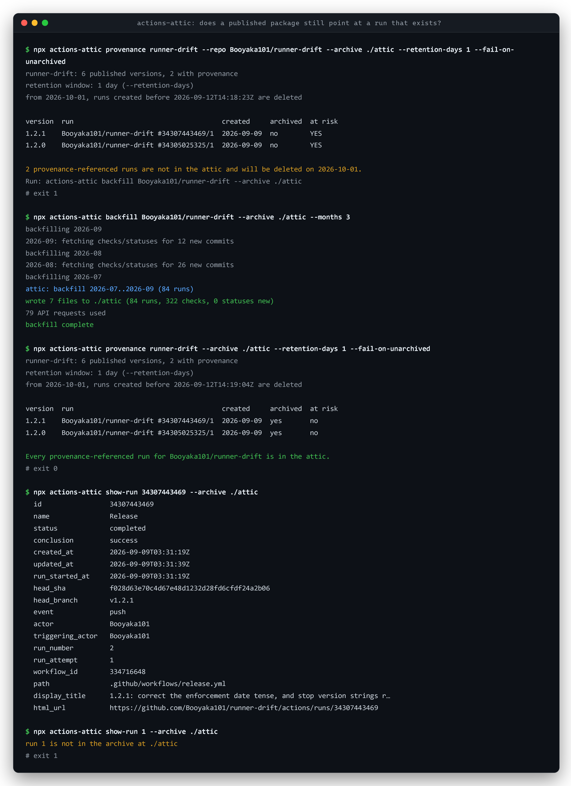

# actions-attic

> "Starting October 1, 2026, checks, workflow runs, and statuses will be governed by the same Actions retention setting."
> Until now they "were retained for 400+ days regardless of your retention configuration". "For public repositories, the maximum retention for checks, workflow runs, and statuses is 90 days."
> "Export or archive anything you need to keep beyond your configured retention period, since older checks, workflow runs, and statuses will be automatically removed."
>
> [GitHub Changelog, 27 August 2026](https://github.blog/changelog/2026-08-27-actions-retention-will-cover-checks-workflow-runs-and-statuses/)

GitHub tells you to export. It does not ship an exporter. This is one.

actions-attic keeps a permanent, plain-text archive of a repository's workflow runs, check runs and commit statuses **inside the repository itself**, on a git ref of its own. No hosted service, no database to run, no credentials beyond the token the workflow already has.

Add this to `.github/workflows/attic.yml`:

```yaml
name: attic
on:
  schedule: [{ cron: '17 3 * * *' }]
  workflow_dispatch:
permissions: { actions: read, checks: read, statuses: read, contents: write }
jobs:
  archive:
    runs-on: ubuntu-latest
    steps:
      - uses: Booyaka101/actions-attic@v1
```

The first run creates `refs/attic/archive` and starts walking history backwards. If it runs out of
request budget it commits what it has and resumes the next night. Once history is captured, each run
takes seconds and makes no commit when nothing changed.

That ref is deliberately not a branch. It stays out of the branch list, out of a normal `git clone`,
out of the pull request base picker, and, importantly, out of `on: push` triggers. A repository with
`on: push: branches: ['**']` would otherwise get a CI run every night forever because of us.


## What it archives

| Path | Contents |
| --- | --- |
| `runs/YYYY-MM.jsonl` | one line per workflow run **attempt**: `id`, `name`, `status`, `conclusion`, `created_at`, `updated_at`, `run_started_at`, `head_sha`, `head_branch`, `event`, `actor`, `triggering_actor`, `run_number`, `run_attempt`, `workflow_id`, `path`, `display_title`, `html_url` |
| `checks/YYYY-MM.jsonl` | one line per check run: `id`, `name`, `status`, `conclusion`, `started_at`, `completed_at`, `head_sha`, `app` |
| `statuses/YYYY-MM.jsonl` | one line per commit status: `id`, `head_sha`, `state`, `context`, `description`, `target_url`, `created_at`, `updated_at` |
| `shas/YYYY-MM.txt` | commits whose checks and statuses have been fetched, so a resumed run does not refetch them |
| `manifest.json` | `schemaVersion`, `backfillFrontier`, `backfillComplete`, `backfillOldestMonth`, `backfillPartial`, `highestRunId`, `lastRun`, `months`, `counts` |

JSONL, sorted, deduped. A month with no runs gets no file. A run that was re-attempted keeps every attempt as its own record.

## The CLI

```
npm i -g actions-attic     # or: npx actions-attic --help
```

```
actions-attic sync <owner/repo>          top up new runs, then continue the backfill
actions-attic backfill <owner/repo>      walk history backwards only
actions-attic incremental <owner/repo>   append new runs only
actions-attic pull <owner/repo>          copy an archive ref down into a local directory
actions-attic preflight <owner/repo>     what the retention change will delete, and what is archived
actions-attic provenance <package>       which npm versions point signed provenance at a run, and is it archived
actions-attic show-run <id>              print the archived record for one run id
actions-attic build                      build a SQLite index over the archive
actions-attic flake <workflow>           flake rate for one workflow
actions-attic stats                      what the archive currently holds
actions-attic runs                       archived runs as JSON lines
```

The CLI writes to a directory instead of a ref, so you can archive from your laptop, and `pull`
brings an archive the Action wrote back down to read locally. It takes the token from `--token`,
`GITHUB_TOKEN`, `GH_TOKEN`, or `gh auth token`.

### Real output

Archiving two months of [`cli/cli`](https://github.com/cli/cli), a repository with several thousand
runs a month, on a deliberately tiny 30-request budget so the resume path is exercised:


<details><summary>the same session as text</summary>

```
$ npx actions-attic backfill cli/cli --archive ./attic --months 2 --max-requests 30 --no-checks --no-statuses
2026-08-01..2026-08-31 hits the 1000-result cap; splitting
2026-08-01..2026-08-15 hits the 1000-result cap; splitting
2026-08-01..2026-08-07 hits the 1000-result cap; splitting
2026-08-16..2026-08-31 hits the 1000-result cap; splitting
2026-08-16..2026-08-23 hits the 1000-result cap; splitting
stopping inside 2026-08; the next run resumes at the windows still outstanding
max-requests ceiling reached after 30 requests; saving progress now
attic: backfill 2026-08 in progress (2,612 runs)
wrote 2 files to ./attic (2,612 runs, 0 checks, 0 statuses new)
30 API requests used
checkpointed: reached the max-requests ceiling of 30

$ npx actions-attic backfill cli/cli --archive ./attic --months 2 --max-requests 30 --no-checks --no-statuses
2026-07-01..2026-07-31 hits the 1000-result cap; splitting
2026-07-01..2026-07-15 hits the 1000-result cap; splitting
stopping inside 2026-07; the next run resumes at the windows still outstanding
max-requests ceiling reached after 30 requests; saving progress now
attic: backfill 2026-08 (2,437 runs)
wrote 3 files to ./attic (2,437 runs, 0 checks, 0 statuses new)
30 API requests used
backfill frontier at 2026-08-01; run again to continue
checkpointed: reached the max-requests ceiling of 30

$ npx actions-attic backfill cli/cli --archive ./attic --months 2 --max-requests 30 --no-checks --no-statuses
2026-07-16..2026-07-31 hits the 1000-result cap; splitting
attic: backfill 2026-07 (2,101 runs)
wrote 2 files to ./attic (2,101 runs, 0 checks, 0 statuses new)
25 API requests used
backfill complete

$ npx actions-attic flake "Unit and Integration Tests" --since 2026-07 --until 2026-07 --archive ./attic
Unit and Integration Tests: 272 runs, 266 success, 6 failure, flake rate 2.2% (peak 2026-07 at 2.2%)
```

</details>

85 requests, 7,148 runs, no duplicates. The archived counts match what the API reports for the same
windows exactly: 3,133 for July and 4,015 for August. The `flake` line is checked against the live
API for the same window too, where `status=success` reports 266 and `status=failure` reports 6.

`flake` counts only runs that concluded `success` or `failure`; cancelled, skipped and still-running
runs are not flake signal. The peak is the worst month by failure rate.

Archiving a small repository from a laptop, then indexing and reading it back:


<details><summary>the same session as text</summary>

```
$ npx actions-attic sync Booyaka101/runner-drift --archive ./attic --months 3
backfilling 2026-09
2026-09: fetching checks/statuses for 12 new commits
backfilling 2026-08
2026-08: fetching checks/statuses for 26 new commits
backfilling 2026-07
attic: backfill 2026-07..2026-09 (84 runs)
wrote 7 files to ./attic (84 runs, 322 checks, 0 statuses new)
79 API requests used
backfill complete

$ npx actions-attic stats --archive ./attic
  repository       Booyaka101/runner-drift
  archive          ./attic
  months           2026-08 .. 2026-09  (2)
  runs             84
  checks           322
  statuses         0
  highest run id   34610056233
  backfill         complete
  last change      2026-09-13T14:22:09.130Z
  schema           v2

$ npx actions-attic build --archive ./attic
indexed 84 runs, 322 checks, 0 statuses across 2 months into ./attic/attic.db

$ npx actions-attic flake ci --archive ./attic
ci: 44 runs, 41 success, 3 failure, flake rate 6.8% (peak 2026-08 at 9.7%)
```

</details>

`pull` does the same for an archive the Action already wrote to a ref, so you never have to
remember a refspec.

## Will this repository lose anything on October 1?

`preflight` answers exactly that: it resolves the retention window (an explicit
`--retention-days`, else the repository's own retention setting, else GitHub's 90-day
platform default), counts the remote runs, check runs and commit statuses created before
the cutoff, and reports how many of them are not in the attic yet. With
`--fail-on-unarchived` it exits 1 while anything is unprotected, so it works as a scheduled
gate; `--json` prints the structured result and nothing else.

A real session against [`Booyaka101/rimpatch`](https://github.com/Booyaka101/rimpatch),
using `--retention-days 5` so its young history has something at risk:

```
$ npx actions-attic preflight Booyaka101/rimpatch --retention-days 5 --fail-on-unarchived
Booyaka101/rimpatch has no archive at refs/attic/archive yet
fetching checks/statuses for 7 commits not yet in the archive
retention window: 5 days (--retention-days)
from 2026-10-01, records created before 2026-08-25T01:10:19Z are deleted
at risk: 14 runs, 112 check runs, 0 statuses
already archived: 0 runs, 0 check runs, 0 statuses
Unarchived and at risk: 14 runs, 112 check runs, 0 statuses. Run: actions-attic backfill Booyaka101/rimpatch

$ npx actions-attic backfill Booyaka101/rimpatch --archive ./attic
backfilling 2026-08
2026-08: fetching checks/statuses for 7 new commits
...
attic: backfill 2025-07..2026-08 (14 runs)
wrote 4 files to ./attic (14 runs, 112 checks, 0 statuses new)
28 API requests used
backfill complete

$ npx actions-attic preflight Booyaka101/rimpatch --retention-days 5 --archive ./attic --fail-on-unarchived
retention window: 5 days (--retention-days)
from 2026-10-01, records created before 2026-08-25T01:10:43Z are deleted
at risk: 14 runs, 112 check runs, 0 statuses
already archived: 14 runs, 112 check runs, 0 statuses
Nothing at risk. 126 records already in the attic.
```

The first command exited 1, the last exited 0. By default preflight compares against the
`refs/attic/archive` ref the Action writes; `--archive` compares against a local directory
instead. Counting runs costs one request, because the runs endpoint reports its true
`total_count` for a `created=` filter even though it serves at most 1,000 results. Checks
and statuses are read from the archive, plus a per-commit fetch for only the commits the
archive has not covered, so a populated attic makes preflight nearly free and an empty one
costs about what the backfill it recommends would.

The Action runs it on a schedule with `mode: preflight`:

```yaml
      - uses: Booyaka101/actions-attic@v1
        with:
          mode: preflight
          fail-on-unarchived: true
```

Checks and statuses come from the same walk. One month of
[`numpy/numpy`](https://github.com/numpy/numpy), which still uses CircleCI commit statuses alongside
Actions checks:

```
$ npx actions-attic backfill numpy/numpy --archive ./attic-numpy --months 1 --max-requests 400
2026-08: fetching checks/statuses for 680 new commits
stopping inside 2026-08; the next run resumes at the windows still outstanding
max-requests ceiling reached after 400 requests; saving progress now
attic: backfill 2026-08 in progress (10,829 runs)
wrote 7 files to ./attic-numpy (10,829 runs, 6,981 checks, 969 statuses new)
400 API requests used
checkpointed: reached the max-requests ceiling of 400

$ head -1 attic-numpy/statuses/2026-08.jsonl
{"id":51478479295,"head_sha":"996fb9685d12daeb3381003ebfcc1d742555e1bd","state":"pending","context":"ci/circleci: build","description":"CircleCI is running your tests","target_url":"https://circleci.com/gh/numpy/numpy/57451","created_at":"2026-08-01T10:32:14Z","updated_at":"2026-08-01T10:32:14Z"}

$ npx actions-attic build --archive ./attic-numpy
indexed 10,829 runs, 6,981 checks, 969 statuses across 2 months into ./attic-numpy/attic.db

$ npx actions-attic flake "Linux tests" --archive ./attic-numpy
Linux tests: 460 runs, 418 success, 42 failure, flake rate 9.1% (peak 2026-08 at 9.1%)
```

That run stopped on its request ceiling with the month's checks half done. The next invocation picks
up at the commits still outstanding rather than starting over, and the SQLite row counts match the
JSONL line counts exactly.

## Does a published package still point at a run that exists?

A package published with npm provenance carries a signed SLSA v1 statement whose
`runDetails.metadata.invocationId` is the Actions run URL, built as `server_url` +
repository + `/actions/runs/` + `run_id` + `/attempts/` + `run_attempt`. That URL is the one
link from a published artifact back to the job that built it, and it is what a supply-chain
review follows. From 2026-10-01 it resolves to a 404 for every version whose run is older
than the retention window.

**Signature verification is unaffected.** Verifying a package never fetches the run, so
`npm audit signatures` and every sigstore check keep working exactly as before. What breaks
is the audit trail the pointer names.

`provenance` reads the packument for the version list, then the attestations endpoint for
each version that has one, decodes the DSSE payload, takes the in-toto statement whose
predicate type is `https://slsa.dev/provenance/v1`, and cross-references the run id and
attempt against the archive using the same identity the archive keys on.

Versions published before early 2024 carry `https://slsa.dev/provenance/v0.2` instead, which
names no run URL. Those are read too, from `invocation.environment`, or from the git remote
in `invocation.configSource.uri` plus the `<run id>-<attempt>` in `metadata.buildInvocationId`
when the environment block is absent. They are the oldest runs a package has, so they are the
ones the retention change reaches first. A real session
against [`runner-drift`](https://www.npmjs.com/package/runner-drift), with
`--retention-days 1` so its young runs fall inside the cutoff:



<details><summary>the same session as text</summary>

```
$ npx actions-attic provenance runner-drift --repo Booyaka101/runner-drift --archive ./attic --retention-days 1 --fail-on-unarchived
runner-drift: 6 published versions, 2 with provenance
retention window: 1 day (--retention-days)
from 2026-10-01, runs created before 2026-09-12T14:18:23Z are deleted

version  run                                     created     archived  at risk
1.2.1    Booyaka101/runner-drift #34307443469/1  2026-09-09  no        YES
1.2.0    Booyaka101/runner-drift #34305025325/1  2026-09-09  no        YES

2 provenance-referenced runs are not in the attic and will be deleted on 2026-10-01.
Run: actions-attic backfill Booyaka101/runner-drift --archive ./attic

$ npx actions-attic backfill Booyaka101/runner-drift --archive ./attic --months 3
backfilling 2026-09
2026-09: fetching checks/statuses for 12 new commits
backfilling 2026-08
2026-08: fetching checks/statuses for 26 new commits
backfilling 2026-07
attic: backfill 2026-07..2026-09 (84 runs)
wrote 7 files to ./attic (84 runs, 322 checks, 0 statuses new)
79 API requests used
backfill complete

$ npx actions-attic provenance runner-drift --archive ./attic --retention-days 1 --fail-on-unarchived
runner-drift: 6 published versions, 2 with provenance
retention window: 1 day (--retention-days)
from 2026-10-01, runs created before 2026-09-12T14:19:04Z are deleted

version  run                                     created     archived  at risk
1.2.1    Booyaka101/runner-drift #34307443469/1  2026-09-09  yes       no
1.2.0    Booyaka101/runner-drift #34305025325/1  2026-09-09  yes       no

Every provenance-referenced run for Booyaka101/runner-drift is in the attic.
```

</details>

The first command exited 1, the last exited 0. `--repo` names the repository whose retention
setting applies, and it is optional: the archive's manifest answers it once there is an
archive, and the provenance itself answers it before that. Pass it when a package's
provenance names more than one repository, the one case neither can decide.

`--json` prints the structured result and nothing else, `--all` lists the versions published
without provenance too, `--version` checks one version, and `--registry` points at a mirror.
`--fail-on-unarchived` exits 1 while a referenced run is unarchived and due for deletion, and
refuses to run at all when there is no archive to check against, so a scheduled check that
loses its token fails rather than passing on no evidence.

The registry half needs no credentials, so `provenance` works without a GitHub token; it
then falls back to GitHub's 90-day platform default for the retention window and says so.
Versions published without provenance are counted, not listed. A run in another repository
is reported as out of scope rather than as unarchived, so checking a package that publishes
from a monorepo you do not archive does not produce false alarms. A version whose run
predates the backfill's oldest month says that, instead of claiming the run is missing.

Only the versions that advertise an attestation are fetched, which for a package with
hundreds of releases is the difference between two requests and several hundred 404s. Pass
`--probe-all` to ask the endpoint about every version regardless.

The Action runs it on a schedule with `mode: provenance`:

```yaml
      - uses: Booyaka101/actions-attic@v1
        with:
          mode: provenance
          package: my-package
          fail-on-unarchived: true
```

### When the run is already gone

`show-run` prints the archived record for a run id, which is the local answer once the run's
own page has been deleted:

```
$ npx actions-attic show-run 34307443469 --archive ./attic
  id                 34307443469
  name               Release
  status             completed
  conclusion         success
  created_at         2026-09-09T03:31:19Z
  updated_at         2026-09-09T03:31:39Z
  run_started_at     2026-09-09T03:31:19Z
  head_sha           f028d63e70c4d67e48d1232d28fd6cfdf24a2b06
  head_branch        v1.2.1
  event              push
  actor              Booyaka101
  triggering_actor   Booyaka101
  run_number         2
  run_attempt        1
  workflow_id        334716648
  path               .github/workflows/release.yml
  display_title      1.2.1: correct the enforcement date tense, and stop version strings r…
  html_url           https://github.com/Booyaka101/runner-drift/actions/runs/34307443469

$ npx actions-attic show-run 1 --archive ./attic
run 1 is not in the archive at ./attic
```

The second command exited 1. `--attempt` picks one of several archived attempts, defaulting
to the highest, and `--json` prints the record exactly as stored.

What `provenance` hands you is a URL, not an id, so `show-run` takes either:

```
$ npx actions-attic show-run https://github.com/Booyaka101/runner-drift/actions/runs/34305025325 --archive ./attic
  id                 34305025325
  name               Release
  status             completed
  ...
  display_title      Fix the six polynomial-redos alerts open on main since 2026-08-14
  html_url           https://github.com/Booyaka101/runner-drift/actions/runs/34305025325
```

An `/attempts/N` suffix on the URL selects that attempt, and an explicit `--attempt` still
wins over it.

`path` and `display_title` are new in 1.4.0. A run record used to carry only `workflow_id`,
which stops resolving the moment the workflow file is deleted or renamed, and never told you
the path as it was at the time. Archives written by 1.3.0 and earlier read back with both
fields `null`; nothing needs to be rewalked.

## Configuration

| Input | Default | Notes |
| --- | --- | --- |
| `token` | `${{ github.token }}` | Needs `actions: read`, `checks: read`, `statuses: read`, `contents: write` |
| `ref` | `refs/attic/archive` | Where the archive lives. A bare name is treated as a branch, so `ref: my-archive` means `refs/heads/my-archive`. |
| `branch` | none | Deprecated since 1.1.0. Still honoured, so upgrading never moves an existing archive. |
| `mode` | `auto` | `auto` tops up new runs then continues the backfill; also `backfill`, `incremental`, `preflight`, `provenance` |
| `backfill-months` | `14` | How far back to walk |
| `max-requests` | `800` | `GITHUB_TOKEN` gets 1,000 requests/hour/repository, so 800 leaves headroom |
| `max-pages` | `50` | Page ceiling for an incremental catch-up |
| `repository` | current repo | Read another repository's history. The branch is always written to the repo running the workflow, which is the only one `github.token` can write to. |
| `skip-checks` / `skip-statuses` | `false` | Runs-only archiving, much cheaper |
| `retention-days` | read from the API | Preflight and provenance: override the retention window |
| `fail-on-unarchived` | `false` | Preflight and provenance: fail the step while at-risk records are unarchived |
| `package` | none | Provenance only: the npm package whose provenance names workflow runs. Required for `mode: provenance`. |
| `registry` | `https://registry.npmjs.org` | Provenance only: read from a mirror instead |
| `probe-all` | `false` | Provenance only: ask the attestations endpoint about every version, not only the advertised ones |

Outputs: `runs-added`, `checks-added`, `statuses-added`, `committed`, `commit-sha`, `backfill-frontier`, `backfill-complete`, `requests-used`, `branch`. Preflight sets `retention-days`, `retention-source`, `unarchived-total` and `preflight-json`. Provenance sets the same three, with `unarchived-total` counting referenced runs due for deletion, plus `provenance-json`.

## How it stays inside the rate limit

`GET /actions/runs` returns at most 1,000 results per search when filtered by `created`, so the backfill windows by month and halves any window that reports 1,000 or more, recursively. `created` accepts full instants, not just dates, so the halving carries on below a day when it has to: a repository doing 12,000 runs in a day is walked as sub-day windows rather than truncated at 1,000. Every response's `x-ratelimit-remaining` and `x-ratelimit-reset` are read, and the walk stops cleanly at `max-requests` or when the live limit gets close.

Progress is checkpointed at three levels, so no work is ever repeated and none is lost:

- **month.** `backfillFrontier` is the first day of the oldest month fully captured
- **window.** A half-finished month records which date windows are done, and which are known to need splitting
- **page.** A window interrupted mid-pagination resumes at the next page

A secondary rate limit with a long `retry-after` checkpoints and exits 0 rather than failing the job. A short one is waited out.

## Reading the archive

```bash
npx actions-attic pull myorg/myrepo --archive ./attic
npx actions-attic build --archive ./attic          # -> ./attic/attic.db
npx actions-attic flake build-linux --since 2025-09 --archive ./attic
```

`pull` reads the ref over the API, so there is no refspec to remember and git does not have to be
involved. If you would rather use git:

```bash
git fetch origin 'refs/attic/*:refs/attic/*'
git restore --source refs/attic/archive --worktree -- .   # or: git cat-file -p refs/attic/archive
```

Each run also prints a `github.com/<owner>/<repo>/tree/<sha>` link, and sets it as the `archive-url`
output, so the archive is still one click away in the browser.

`build` produces a SQLite database (`runs`, `checks`, `statuses`, `meta`) using Node's built-in `node:sqlite`, indexed on name, conclusion, created_at and head_sha. Query it with anything that speaks SQLite:

```sql
SELECT name, COUNT(*) AS runs, ROUND(100.0 * SUM(conclusion='failure') / COUNT(*), 1) AS pct_failed
FROM runs WHERE conclusion IN ('success','failure') AND month >= '2026-01'
GROUP BY name ORDER BY pct_failed DESC;
```

The JSONL is plain text, so `grep`, `jq` and `git log` work on it directly. That is the point: the archive outlives this tool.

## Limitations

- **Single repository per archive.** No org-wide rollup.
- **No log text.** Job logs are a much larger retention problem and are out of scope; this archives the run, check and status metadata.
- **No artifacts.**
- `provenance` reads npm. Other registries publish attestations in their own shapes, and only the
  GitHub Actions build type is parsed, in both the SLSA v1 and v0.2 forms npm has published, so a
  package built anywhere else reports its provenance as unreadable rather than guessing.
- The 1,000-result search cap is worked around by halving the window, down to the second if a day needs it. Only more than 1,000 runs inside a single second is beyond reach; that warns and takes the 1,000 it can get.
- Statuses need pull access. If the token cannot read them the run warns once and carries on with runs and checks.
- A version whose publish date the registry does not report counts as due for deletion. The
  report says so on the row. Guessing the other way would mark an unknown run safe.
- The backfill only reaches as far back as GitHub still has data. Run it **before** 1 October 2026 and you keep what would otherwise be deleted; run it after and you get whatever survived your retention setting.
- Data added to the archive is never removed by this tool. Deleting the branch deletes the archive.
- One writer at a time. Two jobs committing the same archive race on the ref; the loser reloads and
  retries once, then fails loudly. Keep the `concurrency:` block from
  [`examples/attic.yml`](examples/attic.yml) if you also trigger the workflow by hand.
- The archive ref is not browsable at a path like `/tree/refs/attic/archive`, because GitHub's file
  browser only resolves branches, tags and commit SHAs. Use the `archive-url` output, or set
  `ref: actions-attic` to get the old branch behaviour back.

## Requirements

Node 22.5 or newer (for `node:sqlite`). One runtime dependency, `@actions/core`, used only by the Action.

## Development

```bash
npm install
npm test          # builds, then runs node --test test/*.test.mjs
npm run build     # tsc -> lib/, esbuild -> dist/index.cjs
```

Fixtures under `test/fixtures/` are test-only. The archive fixture is regenerated with
`node test/fixtures/generate.mjs`, and it is deliberately still `schemaVersion: 1`, because that is
what proves a 1.3.0 archive still reads. The recorded registry responses come from
`node test/fixtures/record-registry.mjs`, so the provenance tests never touch the network.

The screenshots in `docs/` are rendered from the verbatim session captures in `docs/sessions/`:
`node scripts/screenshots.mjs`, against a Chrome started with `--remote-debugging-port=9222`.
Nothing in those captures is edited by hand; to refresh them, re-run the commands shown at the
top of each file.

## First distribution step

Post in [community discussion #138249](https://github.com/orgs/community/discussions/138249), the two-year-old thread where people have been asking GitHub for exactly this, still labelled "In Backlog". That is where the audience already is, and the October 1 date makes it timely.

## License

MIT
