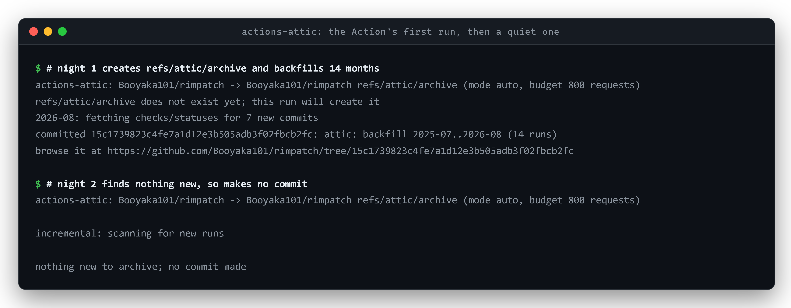
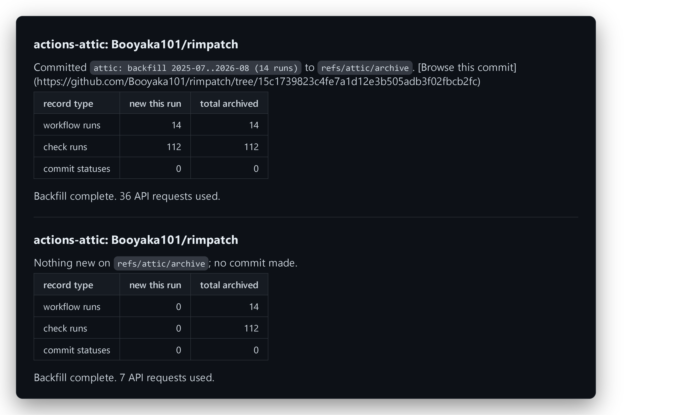
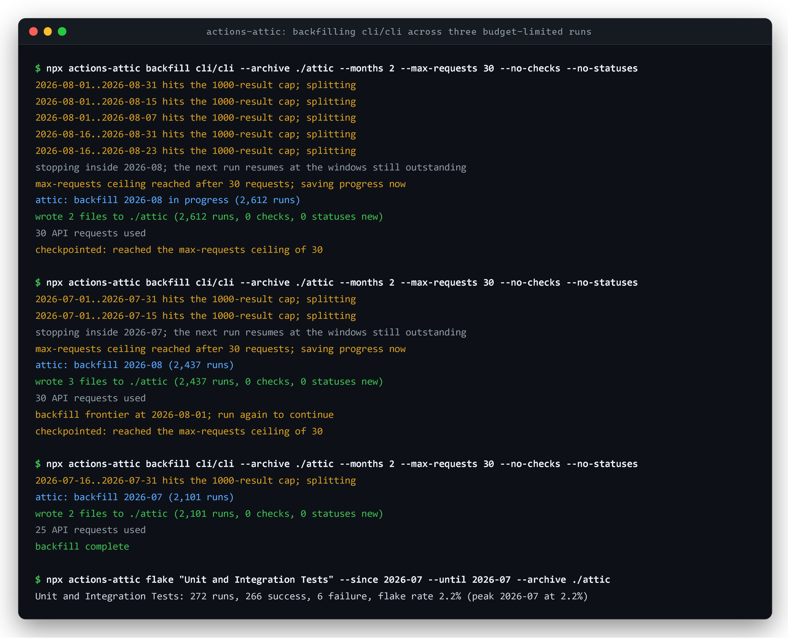
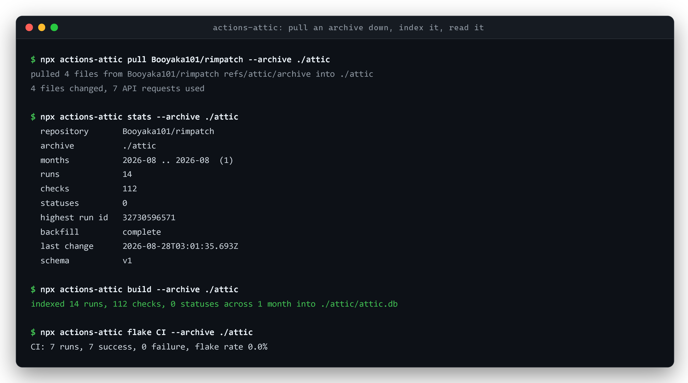

# actions-attic

> "Starting October 1, 2026, checks, workflow runs, and statuses will be governed by the same Actions retention setting."
> Until now they "were retained for 400+ days regardless of your retention configuration". "For public repositories, the maximum retention for checks, workflow runs, and statuses is 90 days."
> "Export or archive anything you need to keep beyond your configured retention period, since older checks, workflow runs, and statuses will be automatically removed."
>
> [GitHub Changelog, 27 August 2026](https://github.blog/changelog/2026-08-27-actions-retention-will-cover-checks-workflow-runs-and-statuses/)

GitHub tells you to export. It does not ship an exporter. This is one.

actions-attic keeps a permanent, plain-text archive of a repository's workflow runs, check runs and commit statuses **inside the repository itself**, on a git ref of its own. No hosted service, no database to run, no credentials beyond the token the workflow already has.

Add this to `.github/workflows/attic.yml`:

```yaml
name: attic
on:
  schedule: [{ cron: '17 3 * * *' }]
  workflow_dispatch:
permissions: { actions: read, checks: read, statuses: read, contents: write }
jobs:
  archive:
    runs-on: ubuntu-latest
    steps:
      - uses: Booyaka101/actions-attic@v1
```

The first run creates `refs/attic/archive` and starts walking history backwards. If it runs out of
request budget it commits what it has and resumes the next night. Once history is captured, each run
takes seconds and makes no commit when nothing changed.

That ref is deliberately not a branch. It stays out of the branch list, out of a normal `git clone`,
out of the pull request base picker, and, importantly, out of `on: push` triggers. A repository with
`on: push: branches: ['**']` would otherwise get a CI run every night forever because of us.





## What it archives

| Path | Contents |
| --- | --- |
| `runs/YYYY-MM.jsonl` | one line per workflow run **attempt**: `id`, `name`, `status`, `conclusion`, `created_at`, `updated_at`, `run_started_at`, `head_sha`, `head_branch`, `event`, `actor`, `triggering_actor`, `run_number`, `run_attempt`, `workflow_id`, `html_url` |
| `checks/YYYY-MM.jsonl` | one line per check run: `id`, `name`, `status`, `conclusion`, `started_at`, `completed_at`, `head_sha`, `app` |
| `statuses/YYYY-MM.jsonl` | one line per commit status: `id`, `head_sha`, `state`, `context`, `description`, `target_url`, `created_at`, `updated_at` |
| `shas/YYYY-MM.txt` | commits whose checks and statuses have been fetched, so a resumed run does not refetch them |
| `manifest.json` | `schemaVersion`, `backfillFrontier`, `backfillComplete`, `backfillOldestMonth`, `backfillPartial`, `highestRunId`, `lastRun`, `months`, `counts` |

JSONL, sorted, deduped. A month with no runs gets no file. A run that was re-attempted keeps every attempt as its own record.

## The CLI

```
npm i -g actions-attic     # or: npx actions-attic --help
```

```
actions-attic sync <owner/repo>          top up new runs, then continue the backfill
actions-attic backfill <owner/repo>      walk history backwards only
actions-attic incremental <owner/repo>   append new runs only
actions-attic pull <owner/repo>          copy an archive ref down into a local directory
actions-attic build                      build a SQLite index over the archive
actions-attic flake <workflow>           flake rate for one workflow
actions-attic stats                      what the archive currently holds
actions-attic runs                       archived runs as JSON lines
```

The CLI writes to a directory instead of a ref, so you can archive from your laptop, and `pull`
brings an archive the Action wrote back down to read locally. It takes the token from `--token`,
`GITHUB_TOKEN`, `GH_TOKEN`, or `gh auth token`.

### Real output

Archiving two months of [`cli/cli`](https://github.com/cli/cli), a repository with several thousand
runs a month, on a deliberately tiny 30-request budget so the resume path is exercised:



<details><summary>the same session as text</summary>

```
$ npx actions-attic backfill cli/cli --archive ./attic --months 2 --max-requests 30 --no-checks --no-statuses
2026-08-01..2026-08-31 hits the 1000-result cap; splitting
2026-08-01..2026-08-15 hits the 1000-result cap; splitting
2026-08-01..2026-08-07 hits the 1000-result cap; splitting
2026-08-16..2026-08-31 hits the 1000-result cap; splitting
2026-08-16..2026-08-23 hits the 1000-result cap; splitting
stopping inside 2026-08; the next run resumes at the windows still outstanding
max-requests ceiling reached after 30 requests; saving progress now
attic: backfill 2026-08 in progress (2,612 runs)
wrote 2 files to ./attic (2,612 runs, 0 checks, 0 statuses new)
30 API requests used
checkpointed: reached the max-requests ceiling of 30

$ npx actions-attic backfill cli/cli --archive ./attic --months 2 --max-requests 30 --no-checks --no-statuses
2026-07-01..2026-07-31 hits the 1000-result cap; splitting
2026-07-01..2026-07-15 hits the 1000-result cap; splitting
stopping inside 2026-07; the next run resumes at the windows still outstanding
max-requests ceiling reached after 30 requests; saving progress now
attic: backfill 2026-08 (2,437 runs)
wrote 3 files to ./attic (2,437 runs, 0 checks, 0 statuses new)
30 API requests used
backfill frontier at 2026-08-01; run again to continue
checkpointed: reached the max-requests ceiling of 30

$ npx actions-attic backfill cli/cli --archive ./attic --months 2 --max-requests 30 --no-checks --no-statuses
2026-07-16..2026-07-31 hits the 1000-result cap; splitting
attic: backfill 2026-07 (2,101 runs)
wrote 2 files to ./attic (2,101 runs, 0 checks, 0 statuses new)
25 API requests used
backfill complete

$ npx actions-attic flake "Unit and Integration Tests" --since 2026-07 --until 2026-07 --archive ./attic
Unit and Integration Tests: 272 runs, 266 success, 6 failure, flake rate 2.2% (peak 2026-07 at 2.2%)
```

</details>

85 requests, 7,148 runs, no duplicates. The archived counts match what the API reports for the same
windows exactly: 3,133 for July and 4,015 for August. The `flake` line is checked against the live
API for the same window too, where `status=success` reports 266 and `status=failure` reports 6.

`flake` counts only runs that concluded `success` or `failure`; cancelled, skipped and still-running
runs are not flake signal. The peak is the worst month by failure rate.

Pulling an archive the Action wrote, then reading it back:



<details><summary>the same session as text</summary>

```
$ npx actions-attic pull Booyaka101/rimpatch --archive ./attic
pulled 4 files from Booyaka101/rimpatch refs/attic/archive into ./attic
4 files changed, 7 API requests used

$ npx actions-attic stats --archive ./attic
  repository       Booyaka101/rimpatch
  archive          ./attic
  months           2026-08 .. 2026-08  (1)
  runs             14
  checks           112
  statuses         0
  highest run id   32730596571
  backfill         complete
  last change      2026-08-28T03:01:35.693Z
  schema           v1

$ npx actions-attic build --archive ./attic
indexed 14 runs, 112 checks, 0 statuses across 1 month into ./attic/attic.db

$ npx actions-attic flake CI --archive ./attic
CI: 7 runs, 7 success, 0 failure, flake rate 0.0%
```

</details>

Checks and statuses come from the same walk. One month of
[`numpy/numpy`](https://github.com/numpy/numpy), which still uses CircleCI commit statuses alongside
Actions checks:

```
$ npx actions-attic backfill numpy/numpy --archive ./attic-numpy --months 1 --max-requests 400
2026-08: fetching checks/statuses for 680 new commits
stopping inside 2026-08; the next run resumes at the windows still outstanding
max-requests ceiling reached after 400 requests; saving progress now
attic: backfill 2026-08 in progress (10,829 runs)
wrote 7 files to ./attic-numpy (10,829 runs, 6,981 checks, 969 statuses new)
400 API requests used
checkpointed: reached the max-requests ceiling of 400

$ head -1 attic-numpy/statuses/2026-08.jsonl
{"id":51478479295,"head_sha":"996fb9685d12daeb3381003ebfcc1d742555e1bd","state":"pending","context":"ci/circleci: build","description":"CircleCI is running your tests","target_url":"https://circleci.com/gh/numpy/numpy/57451","created_at":"2026-08-01T10:32:14Z","updated_at":"2026-08-01T10:32:14Z"}

$ npx actions-attic build --archive ./attic-numpy
indexed 10,829 runs, 6,981 checks, 969 statuses across 2 months into ./attic-numpy/attic.db

$ npx actions-attic flake "Linux tests" --archive ./attic-numpy
Linux tests: 460 runs, 418 success, 42 failure, flake rate 9.1% (peak 2026-08 at 9.1%)
```

That run stopped on its request ceiling with the month's checks half done. The next invocation picks
up at the commits still outstanding rather than starting over, and the SQLite row counts match the
JSONL line counts exactly.

## Configuration

| Input | Default | Notes |
| --- | --- | --- |
| `token` | `${{ github.token }}` | Needs `actions: read`, `checks: read`, `statuses: read`, `contents: write` |
| `ref` | `refs/attic/archive` | Where the archive lives. A bare name is treated as a branch, so `ref: my-archive` means `refs/heads/my-archive`. |
| `branch` | none | Deprecated since 1.1.0. Still honoured, so upgrading never moves an existing archive. |
| `mode` | `auto` | `auto` tops up new runs then continues the backfill; also `backfill`, `incremental` |
| `backfill-months` | `14` | How far back to walk |
| `max-requests` | `800` | `GITHUB_TOKEN` gets 1,000 requests/hour/repository, so 800 leaves headroom |
| `max-pages` | `50` | Page ceiling for an incremental catch-up |
| `repository` | current repo | Read another repository's history. The branch is always written to the repo running the workflow, which is the only one `github.token` can write to. |
| `skip-checks` / `skip-statuses` | `false` | Runs-only archiving, much cheaper |

Outputs: `runs-added`, `checks-added`, `statuses-added`, `committed`, `commit-sha`, `backfill-frontier`, `backfill-complete`, `requests-used`, `branch`.

## How it stays inside the rate limit

`GET /actions/runs` returns at most 1,000 results per search when filtered by `created`, so the backfill windows by month and halves any window that reports 1,000 or more, recursively, down to a single day. Every response's `x-ratelimit-remaining` and `x-ratelimit-reset` are read, and the walk stops cleanly at `max-requests` or when the live limit gets close.

Progress is checkpointed at three levels, so no work is ever repeated and none is lost:

- **month.** `backfillFrontier` is the first day of the oldest month fully captured
- **window.** A half-finished month records which date windows are done, and which are known to need splitting
- **page.** A window interrupted mid-pagination resumes at the next page

A secondary rate limit with a long `retry-after` checkpoints and exits 0 rather than failing the job. A short one is waited out.

## Reading the archive

```bash
npx actions-attic pull myorg/myrepo --archive ./attic
npx actions-attic build --archive ./attic          # -> ./attic/attic.db
npx actions-attic flake build-linux --since 2025-09 --archive ./attic
```

`pull` reads the ref over the API, so there is no refspec to remember and git does not have to be
involved. If you would rather use git:

```bash
git fetch origin 'refs/attic/*:refs/attic/*'
git restore --source refs/attic/archive --worktree -- .   # or: git cat-file -p refs/attic/archive
```

Each run also prints a `github.com/<owner>/<repo>/tree/<sha>` link, and sets it as the `archive-url`
output, so the archive is still one click away in the browser.

`build` produces a SQLite database (`runs`, `checks`, `statuses`, `meta`) using Node's built-in `node:sqlite`, indexed on name, conclusion, created_at and head_sha. Query it with anything that speaks SQLite:

```sql
SELECT name, COUNT(*) AS runs, ROUND(100.0 * SUM(conclusion='failure') / COUNT(*), 1) AS pct_failed
FROM runs WHERE conclusion IN ('success','failure') AND month >= '2026-01'
GROUP BY name ORDER BY pct_failed DESC;
```

The JSONL is plain text, so `grep`, `jq` and `git log` work on it directly. That is the point: the archive outlives this tool.

## Limitations

- **Single repository per archive.** No org-wide rollup.
- **No log text.** Job logs are a much larger retention problem and are out of scope; this archives the run, check and status metadata.
- **No artifacts.**
- A single day with 1,000 or more runs cannot be fully enumerated. GitHub will not serve past that cap for one search. actions-attic warns and takes the 1,000 it can get.
- Statuses need pull access. If the token cannot read them the run warns once and carries on with runs and checks.
- The backfill only reaches as far back as GitHub still has data. Run it **before** 1 October 2026 and you keep what would otherwise be deleted; run it after and you get whatever survived your retention setting.
- Data added to the archive is never removed by this tool. Deleting the branch deletes the archive.
- One writer at a time. Two jobs committing the same archive race on the ref; the loser reloads and
  retries once, then fails loudly. Keep the `concurrency:` block from
  [`examples/attic.yml`](examples/attic.yml) if you also trigger the workflow by hand.
- The archive ref is not browsable at a path like `/tree/refs/attic/archive`, because GitHub's file
  browser only resolves branches, tags and commit SHAs. Use the `archive-url` output, or set
  `ref: actions-attic` to get the old branch behaviour back.

## Requirements

Node 22.5 or newer (for `node:sqlite`). One runtime dependency, `@actions/core`, used only by the Action.

## Development

```bash
npm install
npm test          # builds, then runs node --test test/*.test.mjs
npm run build     # tsc -> lib/, esbuild -> dist/index.cjs
```

Fixtures under `test/fixtures/` are test-only and are regenerated with `node test/fixtures/generate.mjs`.

The screenshots in `docs/` are rendered from the verbatim session captures in `docs/sessions/`:
`node scripts/screenshots.mjs`, against a Chrome started with `--remote-debugging-port=9222`.
Nothing in those captures is edited by hand; to refresh them, re-run the commands shown at the
top of each file.

## First distribution step

Post in [community discussion #138249](https://github.com/orgs/community/discussions/138249), the two-year-old thread where people have been asking GitHub for exactly this, still labelled "In Backlog". That is where the audience already is, and the October 1 date makes it timely.

## License

MIT
